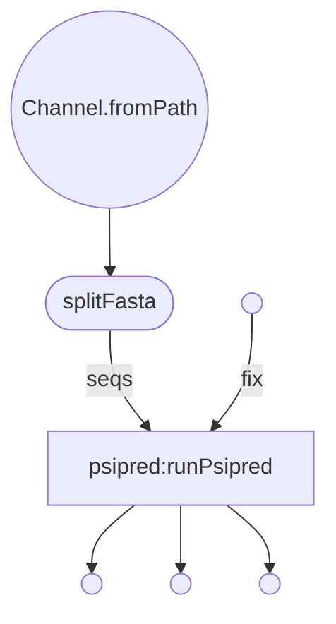

# Nextflow Conversion of PsipredTask.pm

***
PsiPred
***  

Decription of nextflow configuration parameters:

| param         | value type        | description  |
| ------------- | ------------- | ------------ |
| inputFilePath  | string | Path to input file |
| outputDir | string | Path to where you would like output files stored |
| databaseFasta | string | Path to the fasta file that you would like to use a the database for Psipred |

### Get Started
  * Install Nextflow
    
    `curl https://get.nextflow.io | bash`
  
  * Run the script
    
    `nextflow run VEuPathDB/Psipred -with-trace -c  <config_file> -r main`
